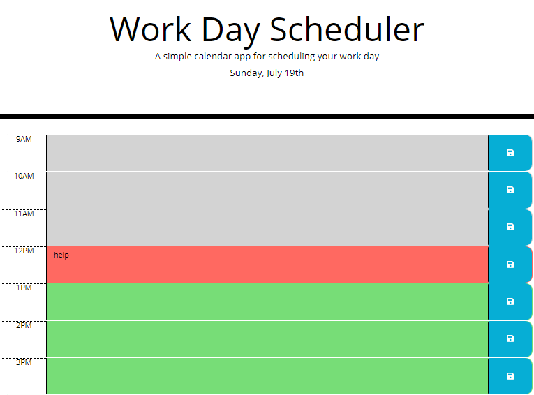

# Day Planner

## Description

```
A simple day planner that highlights the current time and date using Moment.js, JavaScript, and local-storage to manage time as well as save appointments.
```

## Table of Contents 

* [Usage](#usage)

* [Installation](#installation)

* [License](#license)

* [Questions](#questions)


## Usage

Go to [Day-Planner](https://travislovingood.github.io/Day-Planner/) and enjoy.

## Installation

Open a new terminal and run 'npm install'.

## License

This project has no License.
  
## Questions

If you have any questions about the repo, open an issue or contact directly at [Day-Planner](https://github.com/TravisLovingood/Day-Planner).


[My Portfolio](https://travislovingood.github.io/Portfolio/).
